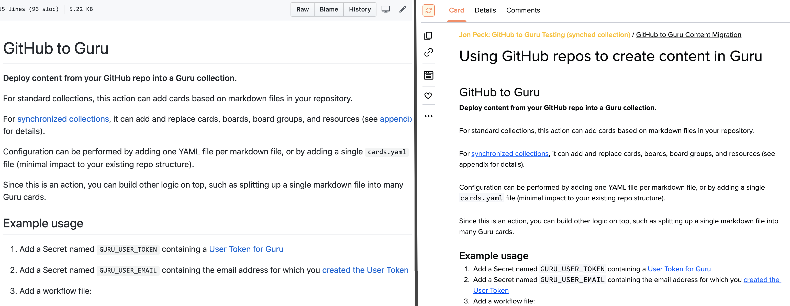

# GitHub to Guru

**Deploy content from your GitHub repo into a Guru collection.**

For standard collections, this action can add cards based on markdown files in your repository.

For [synchronized collections](https://help.getguru.com/articles/T8eX5e5c/Knowledge-Sync-Overview), it can add and replace cards, boards, board groups, and resources (see [appendix](#appendix-creating-a-synchronized-collection) for details).

Configuration can be performed by adding one YAML file per markdown file, or by adding a single `cards.yaml` file (minimal impact to your existing repo structure).

Since this is an action, you can build other logic on top, such as splitting up a single markdown file into many Guru cards.



## Example usage

1. Add a Secret named `GURU_USER_TOKEN` containing a [User Token for Guru](https://help.getguru.com/articles/XipkRKLi/Guru-API-Overview)

2. Add a Secret named `GURU_USER_EMAIL` containing the email address for which you [created the User Token](https://app.getguru.com/settings/api-access)

3. Add a workflow file:

```yaml
name: Create guru cards

on:
  push:
    branches:
      - master

jobs:
  guru:
    runs-on: ubuntu-latest
    steps:
    - uses: actions/checkout@v1
    - uses: peckjon/github-to-guru@master
      env:
        GURU_USER_EMAIL:  '${{ secrets.GURU_USER_EMAIL }}'
        GURU_USER_TOKEN:  '${{ secrets.GURU_USER_TOKEN }}'
        GURU_COLLECTION_ID: '********-****-****-****-************'
        GURU_CARD_FOOTER: 'To edit this card, visit https://github.com/${{ github.repository }}'
```

Set GURU_COLLECTION_ID to the `id` of the collection you wish to update (you can get it from the [collections API](https://api.getguru.com/api/v1/collections)).

GURU_CARD_FOOTER is optional; if used, it will add this text to the end of each Card (separated by a line `\n---\n`). Any instances of `__CARDPATH__` in the footer will be replaced with path to the card relative to the repo root. A suggested footer might be `[EDIT THIS CARD](https://github.com/${{ github.repository }}/tree/master/__CARDPATH__)`.

Then, add one or more of the following to the `env`:

- `GURU_COLLECTION_YAML`: path to a file in your repo containing the YAML describing your collection, as specified in the ([Guru Manual Sync documentation](https://developer.getguru.com/docs/guru-sync-manual-api#root-directory))
- `GURU_CARD_DIR`: the path, in your repo, to a directory containing the YAML and markdown files for your cards ([documentation](https://developer.getguru.com/docs/guru-sync-manual-api#cards))
- `GURU_CARD_YAML`: path to a single .yaml file containing the details for all cards. It should contain one entry (the path to a markdown file in your repo) for each card you wish to add, followed by the ([properties](https://developer.getguru.com/docs/guru-sync-manual-api#cards)) for that individual card, as follows:
```
SomeFile.md: 
  Tags: 
    - "Subject One"
    - "Subject Two"
  Title: "This is Some Thing"
SomePath/SomeOtherFile.md: 
  Tags: 
    - "Subject One"
  Title: "This is Some Other Thing"
```
- `GURU_BOARD_DIR`: the path, in your repo, to a directory containing the YAML and markdown files for your boards ([documentation](https://developer.getguru.com/docs/guru-sync-manual-api#boards))
- `GURU_BOARD_YAML`: path to a single .yaml file containing the details for all boards. It should contain one entry for each board, followed by the ([properties](https://developer.getguru.com/docs/guru-sync-manual-api#boards)) for that individual board, as follows:
```
Board1:
  Title: Board Title
  Description: |
    Multi line
    Description
  Items:
  - ID: "card1"
    Type: "card"
  - Type: "section"
    Title: "My Section"
    Items:
    - ID: "card2"
      Type: "card"
```
- `GURU_BOARDGROUP_DIR`: the path, in your repo, to a directory containing the YAML and markdown files for your board groups ([documentation](https://developer.getguru.com/docs/guru-sync-manual-api#board-groups))
- `GURU_BOARDGROUP_YAML`: path to a single .yaml file containing the details for all board groups. It should contain one entry for each board group, followed by the ([properties](https://developer.getguru.com/docs/guru-sync-manual-api#board-groups)) for that individual board group, as follows:
```
BoardGroup1:
  Title: Board Group One
  Description: My first board group
  Boards:
  - board1
BoardGroup2:
  Title: Board Group One
  Description: |
    Multi line
    Description
  Boards:
  - board2
  - board3
```
- `GURU_RESOURCES_DIR`: the path, in your repo, of a directory whose files should be added as [resources](https://developer.getguru.com/docs/guru-sync-manual-api#resources). All images, PDFs, etc should be placed here, and your markdown files should use _**relative**_ links to reference them. For example, if `GURU_RESOURCES_DIR: 'SomePath/Assets'`, then a markdown file inside the folder `SomePath/SomeOtherFolder` might contain:
```
Here is a PDF link: [somedoc.pdf](../Assets/somedoc.pdf)
Here is a PDF embed: <iframe src="../Assets/somedoc.pdf"></iframe>
```

**An Important Note on Board YAML files:**

- The names of Cards are modified by this script: non-alphanumeric characters are replaced by underscores (`cardFilename.replace(/\.md$/gi,'').replace(/[^a-zA-Z0-9]/gi, '_')`). The Board YAML must use these modified names as the Card IDs (with no filetype suffix). For example, you have a markdown file `someDir/my very 1st Card!.md` and want to list this card on a Board, the Board YAML should have an Item `ID: "someDir/my_very__1_st_Card_"`.

**Other Notes:**

- You cannot use both the `_DIR` and the `_YAML` way of configuring the same entity type. E.g., if you set both `GURU_CARD_DIR` and `GURU_CARD_YAML`, then `GURU_CARD_DIR` will be ignored.
- Although the ([Guru documentation](https://developer.getguru.com/docs/guru-sync-manual-api)) requires an ExternalId and ExternalUrl for most items, you can choose to omit them here for **cards** only; the action can auto-generate these properties for you.
- "Synchronized" collections take a few minutes to finish; you can check their status at `https://api.getguru.com/api/v1/import/JOBID/status`, where JOBID is the "jobId" shown at the end of the `peckjon/github-to-guru@master` step in your workflow's execution log.
- Guru automatically converts Markdown to HTML, but there are some [known issues](https://github.com/peckjon/github-to-guru/issues/7) with the conversion. To preconvert Markdown files using [markdown-it](https://www.npmjs.com/package/markdown-it), set the env`GURU_CONVERT_MARKDOWN` to `true` in your workflow.

### Appendix: creating a synchronized collection

1. Get the ID of a User Group as per https://developer.getguru.com/reference#groups
2. Make a POST to https://api.getguru.com/api/v1/collections of the form:
```
{
  "name": "My Synced Collection",
  "collectionType": "EXTERNAL",
  "description": "",
  "color": "#F44336",
  "publicCardsEnabled": false,
  "syncVerificationEnabled": false,
  "initialAdminGroupId": "(GROUP_ID)"
}
```
